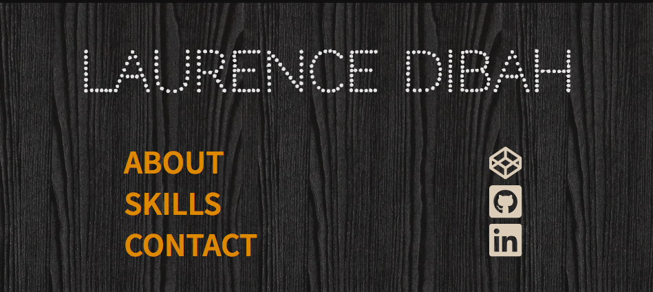
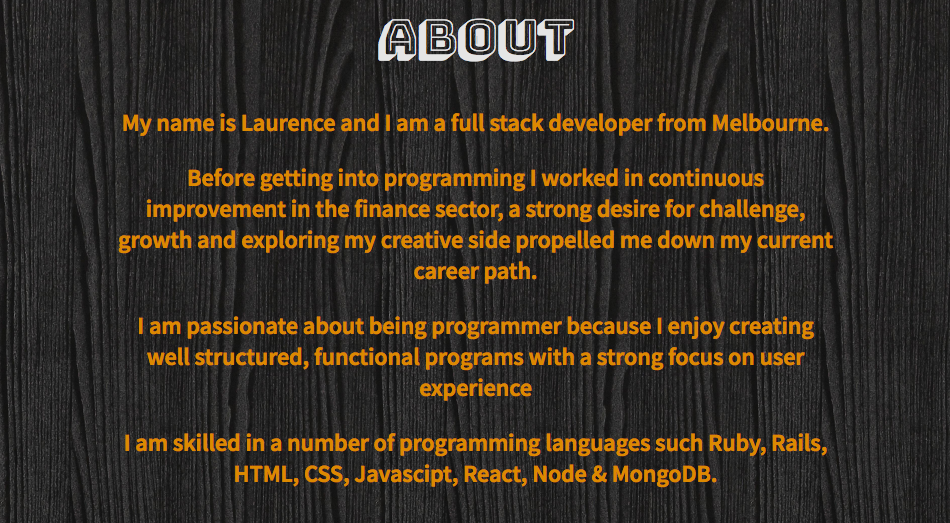
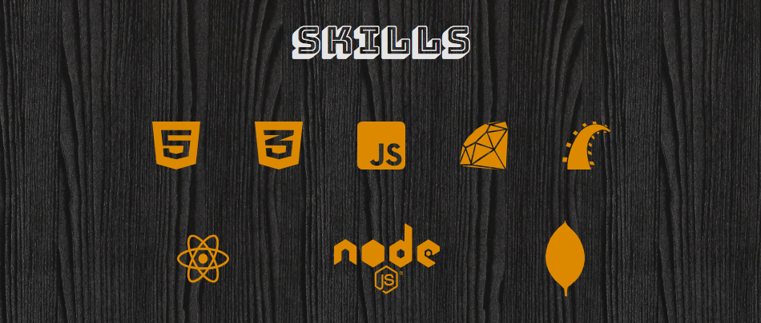
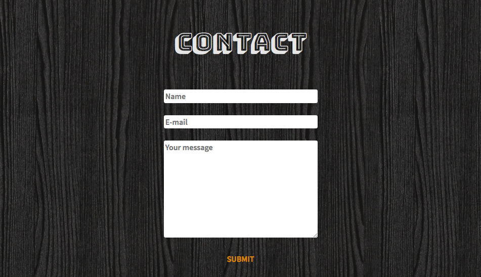
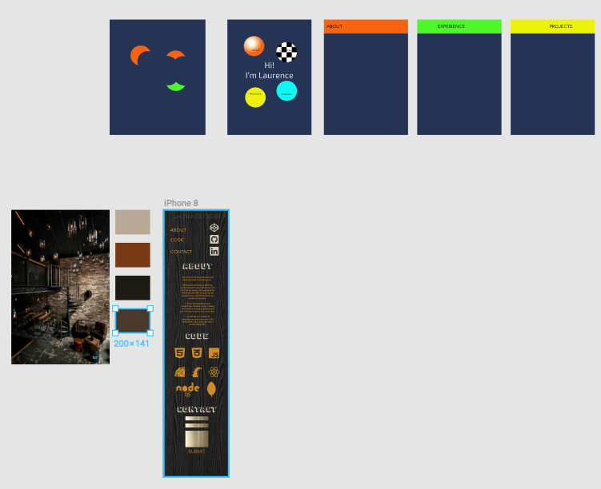
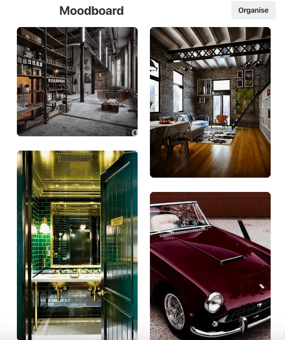

# Term 1 personal portfolio project

[Link to GitHub repository](https://github.com/LDib/LDib.github.io)

## About the site
**Purpose**
The purpose of this portfolio site is to serve as a insight to prosective employers and peers to show examples of my design, my front end ability, provide a cummary of the languages which I am prficient in and a personal background of who I am.

**Functionality / Features**
The site is one scrolling page to keep complexity down. The website enlarges links when hovering over them in the Navigation and Social sections with contrasting colours. The navigation section links to the other sections of the site with smooth scrolling giving the site a buttery feel. The social bar links to Codepen, GitHub and LinkedIn. The about me and skills section give a personal background and a summary of the coding languages I can work with.

The contact form asks the user for the name, e-mail and a message for them to send which successfully comes through to my email address.

## Screenshots

1. Title, nav bar and social links

2. About section

3. Skills section

4. Contact form

## Tech Stack
- HTML
- CSS
- Git

## Design Process
Not having a design or really creative background made it quite difficult to get started with this project. I had a few false starts and nothing was coming to fruition so decided to pick an image that I found appealing and began using colour matching features such as colour palette and Adobe Colour wheel to extract the colours that I would be working with to come up with the final design to code out.

- Figma design

I kept several design considerations in mind around accessibility so I tried to pick colours that would contrast well but still keep the general design theme of the inspiring image.

- Image it was based off

- Pinterest board

# Short Answer Q&A's

1. The biggest initial expansion of the internet occurred in the 1980’s where it gained popularity in commercial industries and academia where e-mail first began to be used. This initial phase required a rethinking of the infrastructure of the internet to handle its rapidly expanding popularity and the creation of domain names that we use today occurred in 1984.

The early 90’s saw the actual creation of the World Wide Web by Tim Bernes-Lee, the creation of Mosaic; the first web browser to combine graphics and text on a single page which became the first commercial web browser, Netscape. The mid to late 90’s saw the creation of companies such as Google, Amazon and Napster, the latter which popularized internet usage through music file sharing.

The 2000’s saw the most rapid boom in use and advancement of the internet, World Internet Population went from 500 million in 2002 to 1 billion in 2006 and then 1.5 billion in 2008. Services like Facebook and Youtube were launched and the internet becomes a major part of almost half of the world population, with about 45% of the global population regularly accessing the internet.

2. When we browse the internet we do it with web browsers that are configured to read the information stored on web servers. When we want to communicate with another computer (eg. Visit a site) the request goes from our web browser, through to our ISP (Internet Service Provider) where the domain name that we have entered (web address) is cross checked against a DNS (Domain Name Register). When the DNS returns a match of the web address, the IP address which is represented by the web address is provided and we are then connected to the server or computer and the information we have requested, that is determined by the web address that we have entered is returned along the same path.

When information is sent across the internet it is broken down into packets which travel in many pieces across the network infrastructure and get pieced together when they appear in our web browser.

3. The internet technology I would like to focus on is Video Streaming. Since the launch of YouTube in 2005 video streaming has exploded in popularity. What was once seemingly the destination of mainly, cute kitten videos has become a new media distribution empire in its own right. Our consumption of video has historically been determined by scheduling and content limited by decisions made by media distributors. 

Companies such as YouTube and more recently Netflix have drastically changed not only the way that we consume media but also the ability of people to publish themselves.

Traditionally the only way that one would be able to share their thoughts or ideas in a video format would be through a traditional media organisation and there were significant barriers to entry as well as a lack of editorial freedom. Streaming platforms have opened the possibility of anyone who wishes to engage an audience the ease of simply creating an account and uploading their content into the free market of ideas. 

Consumption of such content has also been limited by the scheduling of those who are distributing it, whereas now if a user wants to get a particular episode of a TV show or watch a movie they have instant access anytime. Consumption of media and the sharing of ideas has reached new heights not previously thought possible, and in my opinion has been the largest expansion of the sharing of ideas since the creation of the printing press.

